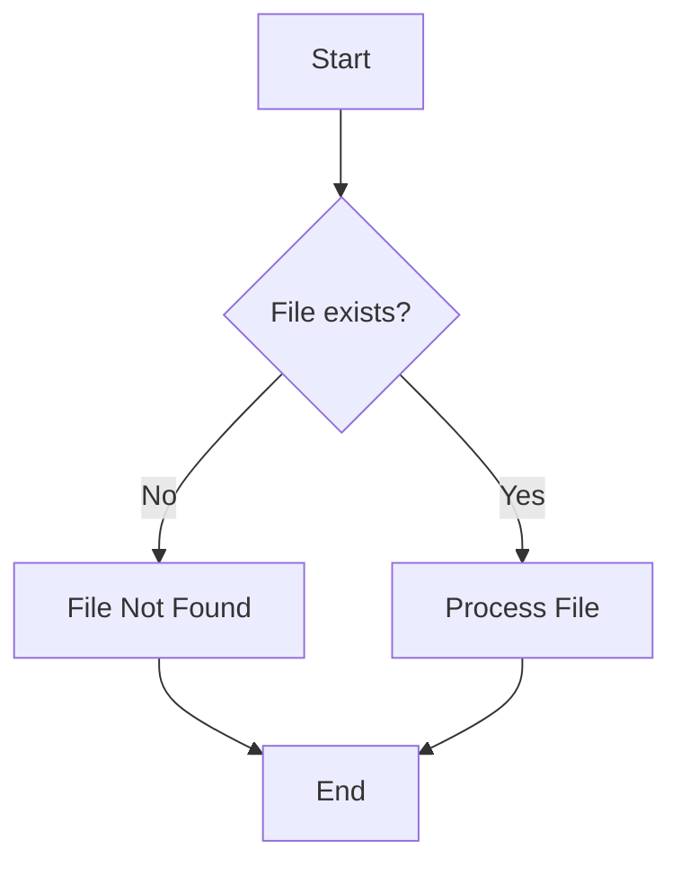
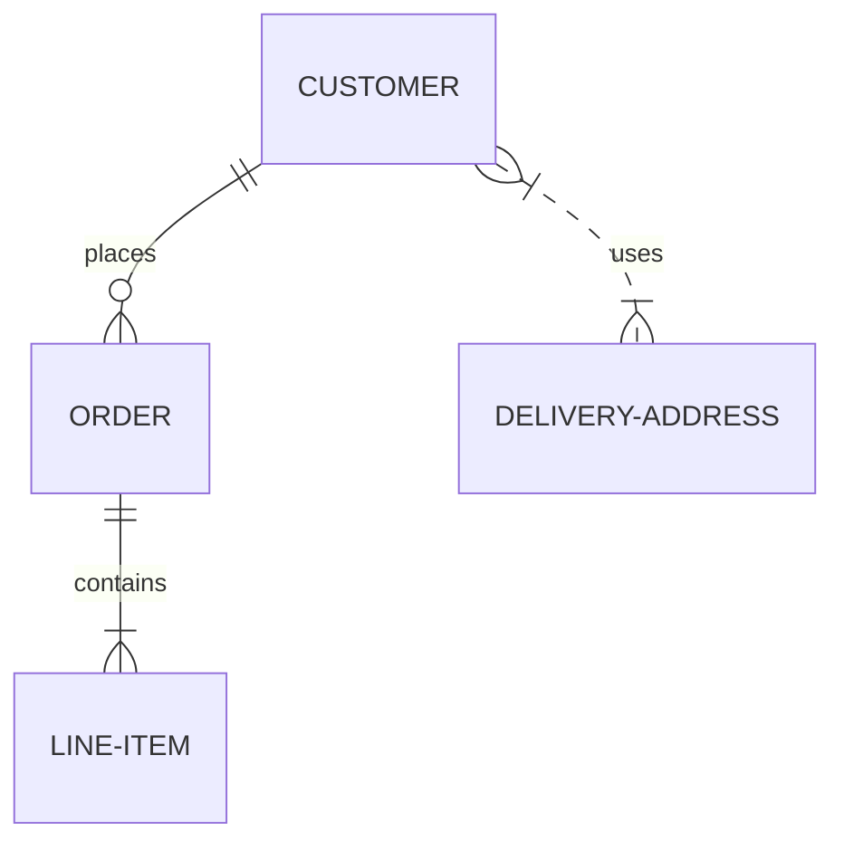

```mermaid
graph TD
    A[Start] --> B{File exists?}
    B -->|Yes| D[Process File]
    B -->|No| C[File Not Found]
    C --> E[End]
    D --> E[End]
```

```mermaid
erDiagram
    CUSTOMER ||--o{ ORDER : places
    ORDER ||--|{ LINE-ITEM : contains
    CUSTOMER }|..|{ DELIVERY-ADDRESS : uses
```
